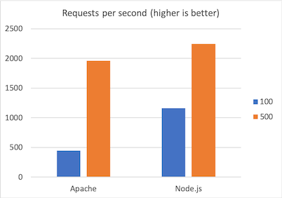
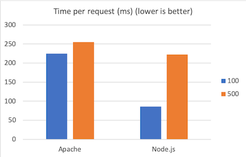
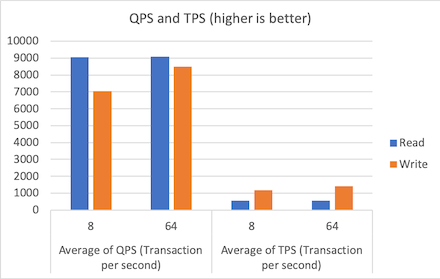
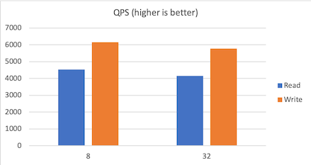

# 503S Performance Report

**Table of contents**

- [1 Experiment: Node.js v Apache](#1-experiment--nodejs-v-apache)
  * [1.1 Node.js](#11-nodejs)
    + [1.1.0 Setup](#110-setup)
    + [1.1.1 Benchmark: `concurrency = 100`](#111-benchmark---concurrency---100-)
    + [1.1.2 Benchmark: `concurrency = 500`](#112-benchmark---concurrency---500-)
  * [1.2 Apache](#12-apache)
    + [1.2.0 Setup](#120-setup)
    + [1.2.1 Benchmark: `concurrency = 100`](#121-benchmark---concurrency---100-)
    + [1.1.2 Benchmark: `concurrency = 500`](#112-benchmark---concurrency---500--1)
  * [1.3 Write-up](#13-write-up)
    + [1.3.1 Discussion of results](#131-discussion-of-results)
    + [1.3.2 Potential bottlenecks](#132-potential-bottlenecks)
    + [1.3.3 Recommendation](#133-recommendation)
- [2 Experiment: MySQL v MongoDB](#2-experiment--mysql-v-mongodb)
  * [2.1 MySQL](#21-mysql)
    + [2.1.0 Setup](#210-setup)
    + [2.1.1 Benchmark: read-only, 120 seconds, `8 threads`](#211-benchmark--read-only--120-seconds---8-threads-)
    + [2.1.2 Benchmark: read-only, 120 seconds, `64 threads`](#212-benchmark--read-only--120-seconds---64-threads-)
    + [2.1.3 Benchmark: write-only, 120 seconds, `8 threads`](#213-benchmark--write-only--120-seconds---8-threads-)
    + [2.1.4 Benchmark: write-only, 120 seconds, `64 threads`](#214-benchmark--write-only--120-seconds---64-threads-)
  * [2.2 MongoDB](#22-mongodb)
    + [2.2.0 Setup](#220-setup)
    + [2.2.1 Benchmark: `read-only`, `8 threads`](#221-benchmark---read-only----8-threads-)
    + [2.2.2 Benchmark: `read-only`, `32 threads`](#222-benchmark---read-only----32-threads-)
    + [2.2.3 Benchmark: `write-only`, `8 threads`](#223-benchmark---write-only----8-threads-)
    + [2.2.4 Benchmark: `write-only`, `32 threads`](#224-benchmark---write-only----32-threads-)
  * [2.3 Write-up](#23-write-up)
    + [2.3.1 Discussion of results](#231-discussion-of-results)
    + [2.3.2 Potential bottlenecks](#232-potential-bottlenecks)
    + [3.3.3 Recommendation](#333-recommendation)
- [Reference](#reference)

## 1 Experiment: Node.js v Apache

### 1.1 Node.js

#### 1.1.0 Setup

Tests are run on `college.html` served by **Node.js**.

Benchmark tool **ab** is used, with different levels of concurrency (100 and 500), to collect data of two measurements: *Requests per seconds* and *Time per request (ms)*.

#### 1.1.1 Benchmark: `concurrency = 100`

```c
Concurrency Level:      100
Time taken for tests:   0.431 seconds
Complete requests:      500
Failed requests:        0
Total transferred:      374000 bytes
HTML transferred:       324000 bytes
Requests per second:    1159.91 [#/sec] (mean)
Time per request:       86.213 [ms] (mean)
Time per request:       0.862 [ms] (mean, across all concurrent requests)
Transfer rate:          847.28 [Kbytes/sec] received

Connection Times (ms)
              min  mean[+/-sd] median   max
Connect:       21   25   1.9     25      31
Processing:    21   46  13.0     45      68
Waiting:       21   41  10.0     42      62
Total:         43   71  13.6     71      93

Percentage of the requests served within a certain time (ms)
  50%     71
  66%     78
  75%     81
  80%     86
  90%     90
  95%     91
  98%     92
  99%     93
 100%     93 (longest request)
```

#### 1.1.2 Benchmark: `concurrency = 500`

```c
Concurrency Level:      500
Time taken for tests:   0.223 seconds
Complete requests:      500
Failed requests:        0
Total transferred:      374000 bytes
HTML transferred:       324000 bytes
Requests per second:    2246.38 [#/sec] (mean)
Time per request:       222.580 [ms] (mean)
Time per request:       0.445 [ms] (mean, across all concurrent requests)
Transfer rate:          1640.91 [Kbytes/sec] received

Connection Times (ms)
              min  mean[+/-sd] median   max
Connect:        0   10   8.3     12      24
Processing:    20   79  26.9    101     109
Waiting:        0   56  18.9     59      88
Total:         20   89  34.5    115     125

Percentage of the requests served within a certain time (ms)
  50%    115
  66%    119
  75%    121
  80%    121
  90%    121
  95%    125
  98%    125
  99%    125
 100%    125 (longest request)
```

### 1.2 Apache

#### 1.2.0 Setup

Tests are run on `college.html` served by **Apache**.

Benchmark tool **ab** is used, with different levels of concurrency (100 and 500), to collect data of two measurements: *Requests per seconds* and *Time per request (ms)*.

#### 1.2.1 Benchmark: `concurrency = 100`

```c
Concurrency Level:      100
Time taken for tests:   1.124 seconds
Complete requests:      500
Failed requests:        0
Total transferred:      461000 bytes
HTML transferred:       324000 bytes
Requests per second:    445.03 [#/sec] (mean)
Time per request:       224.705 [ms] (mean)
Time per request:       2.247 [ms] (mean, across all concurrent requests)
Transfer rate:          400.70 [Kbytes/sec] received

Connection Times (ms)
              min  mean[+/-sd] median   max
Connect:       20   22   1.1     22      29
Processing:    22  174  39.8    183     229
Waiting:       21  174  39.8    183     229
Total:         43  197  39.6    205     253

Percentage of the requests served within a certain time (ms)
  50%    205
  66%    209
  75%    217
  80%    220
  90%    224
  95%    230
  98%    236
  99%    248
 100%    253 (longest request)
```

#### 1.1.2 Benchmark: `concurrency = 500`

```c
Concurrency Level:      500
Time taken for tests:   0.255 seconds
Complete requests:      500
Failed requests:        0
Total transferred:      461000 bytes
HTML transferred:       324000 bytes
Requests per second:    1958.58 [#/sec] (mean)
Time per request:       255.287 [ms] (mean)
Time per request:       0.511 [ms] (mean, across all concurrent requests)
Transfer rate:          1763.49 [Kbytes/sec] received

Connection Times (ms)
              min  mean[+/-sd] median   max
Connect:        0    8   8.8      7      23
Processing:     2   72  86.2     26     230
Waiting:        1   71  86.4     25     230
Total:         11   80  94.3     27     253

Percentage of the requests served within a certain time (ms)
  50%     27
  66%     28
  75%    228
  80%    233
  90%    243
  95%    247
  98%    251
  99%    252
 100%    253 (longest request)
```

### 1.3 Write-up

#### 1.3.1 Discussion of results





Note: `100` and `500` are concurrency levels used in tests.

1. **Node.js** offers better performance than **Apache**, in terms of both measurements of *Requests per second* and *Time per request (ms)*.
2. **Node.js** is more sensitive (slows down more significantly) than **Apache** when the concurrency level increased from 100 to 500.

#### 1.3.2 Potential bottlenecks

For **Node.js**, it consumes less both CPU and memory when running tests. Therefore, the potential bottleneck of the system should be the **bandwidth**.

For **Apache**, it consumes more both CPU and memory when running test. Therefore, itself is the bottleneck, particularly when handling multiple requests concurrently.

#### 1.3.3 Recommendation

Based on the results, **Node.js** is recommended instead of **Apache**, because of its better performance.

## 2 Experiment: MySQL v MongoDB

### 2.1 MySQL

#### 2.1.0 Setup

```c
sysbench /usr/share/sysbench/oltp_read_write.lua --mysql-host=localhost --mysql-port=3306 --mysql-user=sysbench --mysql-password='niubai-pwd' --mysql-db=sysbench --db-driver=mysql --tables=3 --table-size=1000000  prepare
```

The code above created **3 tables** to run benchmark on, with each containing approximately **1 million rows** of data.

Benchmark tool **sysbench** is used, with different types of operation (read and write) and different numbers of threads (8 and 64), to collect data of two measurements: *QPS (Queries per second)* and *TPS (Transaction per second)*.

#### 2.1.1 Benchmark: read-only, 120 seconds, `8 threads`

Script

```c
sysbench /usr/share/sysbench/oltp_read_only.lua --mysql-host=localhost --mysql-port=3306 --mysql-user=sysbench --mysql-password='niubai-pwd' --mysql-db=sysbench --db-driver=mysql --tables=3 --table-size=1000000 --report-interval=10 --threads=8 --time=120 run 2>&1
```

Output

```c
Threads started!

[ 10s ] thds: 8 tps: 534.78 qps: 8562.22 (r/w/o: 7491.97/0.00/1070.25) lat (ms,95%): 22.28 err/s: 0.00 reconn/s: 0.00
[ 20s ] thds: 8 tps: 547.42 qps: 8758.63 (r/w/o: 7663.68/0.00/1094.94) lat (ms,95%): 21.50 err/s: 0.00 reconn/s: 0.00
[ 30s ] thds: 8 tps: 545.88 qps: 8734.63 (r/w/o: 7642.86/0.00/1091.77) lat (ms,95%): 21.50 err/s: 0.00 reconn/s: 0.00
[ 40s ] thds: 8 tps: 548.82 qps: 8782.69 (r/w/o: 7685.06/0.00/1097.64) lat (ms,95%): 21.50 err/s: 0.00 reconn/s: 0.00
[ 50s ] thds: 8 tps: 557.48 qps: 8917.18 (r/w/o: 7802.32/0.00/1114.86) lat (ms,95%): 21.50 err/s: 0.00 reconn/s: 0.00
[ 60s ] thds: 8 tps: 536.80 qps: 8591.67 (r/w/o: 7517.97/0.00/1073.71) lat (ms,95%): 22.69 err/s: 0.00 reconn/s: 0.00
[ 70s ] thds: 8 tps: 548.09 qps: 8768.48 (r/w/o: 7672.30/0.00/1096.19) lat (ms,95%): 22.69 err/s: 0.00 reconn/s: 0.00
[ 80s ] thds: 8 tps: 565.40 qps: 9047.35 (r/w/o: 7916.56/0.00/1130.79) lat (ms,95%): 21.89 err/s: 0.00 reconn/s: 0.00
[ 90s ] thds: 8 tps: 597.11 qps: 9550.34 (r/w/o: 8356.12/0.00/1194.22) lat (ms,95%): 20.74 err/s: 0.00 reconn/s: 0.00
[ 100s ] thds: 8 tps: 598.98 qps: 9583.25 (r/w/o: 8385.38/0.00/1197.87) lat (ms,95%): 21.11 err/s: 0.00 reconn/s: 0.00
[ 110s ] thds: 8 tps: 597.61 qps: 9564.90 (r/w/o: 8369.58/0.00/1195.33) lat (ms,95%): 20.74 err/s: 0.00 reconn/s: 0.00
[ 120s ] thds: 8 tps: 602.48 qps: 9641.45 (r/w/o: 8436.48/0.00/1204.97) lat (ms,95%): 20.74 err/s: 0.00 reconn/s: 0.00
SQL statistics:
    queries performed:
        read:                            949452
        write:                           0
        other:                           135636
        total:                           1085088
    transactions:                        67818  (565.04 per sec.)
    queries:                             1085088 (9040.58 per sec.)
    ignored errors:                      0      (0.00 per sec.)
    reconnects:                          0      (0.00 per sec.)

General statistics:
    total time:                          120.0224s
    total number of events:              67818

Latency (ms):
         min:                                    1.26
         avg:                                   14.15
         max:                                   88.36
         95th percentile:                       21.50
         sum:                               959819.84

Threads fairness:
    events (avg/stddev):           8477.2500/19.84
    execution time (avg/stddev):   119.9775/0.00
```

#### 2.1.2 Benchmark: read-only, 120 seconds, `64 threads`

Script

```c
sysbench /usr/share/sysbench/oltp_read_only.lua --mysql-host=localhost --mysql-port=3306 --mysql-user=sysbench --mysql-password='niubai-pwd' --mysql-db=sysbench --db-driver=mysql --tables=3 --table-size=1000000 --report-interval=10 --threads=64 --time=120 run 2>&1
```

Output

```c
Threads started!

[ 10s ] thds: 64 tps: 557.58 qps: 8982.55 (r/w/o: 7861.11/0.00/1121.44) lat (ms,95%): 183.21 err/s: 0.00 reconn/s: 0.00
[ 20s ] thds: 64 tps: 567.78 qps: 9094.95 (r/w/o: 7959.28/0.00/1135.67) lat (ms,95%): 176.73 err/s: 0.00 reconn/s: 0.00
[ 30s ] thds: 64 tps: 570.88 qps: 9118.35 (r/w/o: 7976.59/0.00/1141.76) lat (ms,95%): 179.94 err/s: 0.00 reconn/s: 0.00
[ 40s ] thds: 64 tps: 571.28 qps: 9161.21 (r/w/o: 8018.66/0.00/1142.55) lat (ms,95%): 176.73 err/s: 0.00 reconn/s: 0.00
[ 50s ] thds: 64 tps: 568.53 qps: 9084.35 (r/w/o: 7947.49/0.00/1136.86) lat (ms,95%): 179.94 err/s: 0.00 reconn/s: 0.00
[ 60s ] thds: 64 tps: 573.80 qps: 9180.09 (r/w/o: 8032.29/0.00/1147.80) lat (ms,95%): 176.73 err/s: 0.00 reconn/s: 0.00
[ 70s ] thds: 64 tps: 568.12 qps: 9092.66 (r/w/o: 7956.52/0.00/1136.15) lat (ms,95%): 176.73 err/s: 0.00 reconn/s: 0.00
[ 80s ] thds: 64 tps: 569.88 qps: 9112.81 (r/w/o: 7973.06/0.00/1139.75) lat (ms,95%): 176.73 err/s: 0.00 reconn/s: 0.00
[ 90s ] thds: 64 tps: 566.60 qps: 9067.00 (r/w/o: 7933.70/0.00/1133.30) lat (ms,95%): 179.94 err/s: 0.00 reconn/s: 0.00
[ 100s ] thds: 64 tps: 567.39 qps: 9069.46 (r/w/o: 7934.68/0.00/1134.78) lat (ms,95%): 179.94 err/s: 0.00 reconn/s: 0.00
[ 110s ] thds: 64 tps: 565.90 qps: 9065.53 (r/w/o: 7933.73/0.00/1131.80) lat (ms,95%): 179.94 err/s: 0.00 reconn/s: 0.00
[ 120s ] thds: 64 tps: 567.63 qps: 9069.44 (r/w/o: 7935.67/0.00/1133.77) lat (ms,95%): 179.94 err/s: 0.00 reconn/s: 0.00
SQL statistics:
    queries performed:
        read:                            955108
        write:                           0
        other:                           136444
        total:                           1091552
    transactions:                        68222  (568.04 per sec.)
    queries:                             1091552 (9088.58 per sec.)
    ignored errors:                      0      (0.00 per sec.)
    reconnects:                          0      (0.00 per sec.)

General statistics:
    total time:                          120.0998s
    total number of events:              68222

Latency (ms):
         min:                                    1.42
         avg:                                  112.61
         max:                                  297.57
         95th percentile:                      179.94
         sum:                              7682267.36

Threads fairness:
    events (avg/stddev):           1065.9688/4.21
    execution time (avg/stddev):   120.0354/0.03
```

#### 2.1.3 Benchmark: write-only, 120 seconds, `8 threads`

Script

```c
sysbench /usr/share/sysbench/oltp_write_only.lua --mysql-host=localhost --mysql-port=3306 --mysql-user=sysbench --mysql-password='niubai-pwd' --mysql-db=sysbench --db-driver=mysql --tables=3 --table-size=1000000 --report-interval=10 --threads=8 --time=120 run 2>&1
```

Output

```c
Threads started!

[ 10s ] thds: 8 tps: 1072.62 qps: 6437.31 (r/w/o: 0.00/4291.27/2146.04) lat (ms,95%): 16.12 err/s: 0.00 reconn/s: 0.00
[ 20s ] thds: 8 tps: 1087.59 qps: 6525.13 (r/w/o: 0.00/4349.95/2175.18) lat (ms,95%): 14.46 err/s: 0.00 reconn/s: 0.00
[ 30s ] thds: 8 tps: 1153.61 qps: 6923.28 (r/w/o: 0.00/4616.05/2307.23) lat (ms,95%): 13.70 err/s: 0.00 reconn/s: 0.00
[ 40s ] thds: 8 tps: 1184.65 qps: 7108.58 (r/w/o: 0.00/4739.29/2369.29) lat (ms,95%): 13.46 err/s: 0.00 reconn/s: 0.00
[ 50s ] thds: 8 tps: 1117.40 qps: 6704.38 (r/w/o: 0.00/4469.59/2234.79) lat (ms,95%): 15.27 err/s: 0.00 reconn/s: 0.00
[ 60s ] thds: 8 tps: 1219.39 qps: 7315.64 (r/w/o: 0.00/4876.86/2438.78) lat (ms,95%): 13.22 err/s: 0.00 reconn/s: 0.00
[ 70s ] thds: 8 tps: 1212.31 qps: 7275.08 (r/w/o: 0.00/4850.45/2424.63) lat (ms,95%): 13.22 err/s: 0.00 reconn/s: 0.00
[ 80s ] thds: 8 tps: 1211.25 qps: 7264.97 (r/w/o: 0.00/4842.48/2422.49) lat (ms,95%): 13.22 err/s: 0.00 reconn/s: 0.00
[ 90s ] thds: 8 tps: 1162.13 qps: 6973.20 (r/w/o: 0.00/4648.93/2324.27) lat (ms,95%): 14.46 err/s: 0.00 reconn/s: 0.00
[ 100s ] thds: 8 tps: 1230.37 qps: 7384.09 (r/w/o: 0.00/4923.36/2460.73) lat (ms,95%): 12.75 err/s: 0.00 reconn/s: 0.00
[ 110s ] thds: 8 tps: 1187.85 qps: 7126.42 (r/w/o: 0.00/4750.71/2375.71) lat (ms,95%): 13.70 err/s: 0.00 reconn/s: 0.00
[ 120s ] thds: 8 tps: 1233.61 qps: 7399.27 (r/w/o: 0.00/4932.65/2466.62) lat (ms,95%): 13.95 err/s: 0.00 reconn/s: 0.00
SQL statistics:
    queries performed:
        read:                            0
        write:                           562932
        other:                           281466
        total:                           844398
    transactions:                        140733 (1172.20 per sec.)
    queries:                             844398 (7033.18 per sec.)
    ignored errors:                      0      (0.00 per sec.)
    reconnects:                          0      (0.00 per sec.)

General statistics:
    total time:                          120.0575s
    total number of events:              140733

Latency (ms):
         min:                                    0.82
         avg:                                    6.82
         max:                                  210.94
         95th percentile:                       13.95
         sum:                               959591.25

Threads fairness:
    events (avg/stddev):           17591.6250/47.57
    execution time (avg/stddev):   119.9489/0.00
```

#### 2.1.4 Benchmark: write-only, 120 seconds, `64 threads`

Script

```c
sysbench /usr/share/sysbench/oltp_write_only.lua --mysql-host=localhost --mysql-port=3306 --mysql-user=sysbench --mysql-password='niubai-pwd' --mysql-db=sysbench --db-driver=mysql --tables=3 --table-size=1000000 --report-interval=10 --threads=64 --time=120 run 2>&1
```

Output

```c
Threads started!

[ 10s ] thds: 64 tps: 1425.30 qps: 8570.96 (r/w/o: 0.00/5713.97/2856.99) lat (ms,95%): 89.16 err/s: 0.00 reconn/s: 0.00
[ 20s ] thds: 64 tps: 1380.61 qps: 8287.77 (r/w/o: 0.00/5526.54/2761.23) lat (ms,95%): 97.55 err/s: 0.00 reconn/s: 0.00
[ 30s ] thds: 64 tps: 1408.37 qps: 8443.00 (r/w/o: 0.00/5626.25/2816.74) lat (ms,95%): 108.68 err/s: 0.00 reconn/s: 0.00
[ 40s ] thds: 64 tps: 1459.54 qps: 8757.46 (r/w/o: 0.00/5838.37/2919.09) lat (ms,95%): 104.84 err/s: 0.00 reconn/s: 0.00
[ 50s ] thds: 64 tps: 1407.74 qps: 8453.70 (r/w/o: 0.00/5638.22/2815.48) lat (ms,95%): 112.67 err/s: 0.00 reconn/s: 0.00
[ 60s ] thds: 64 tps: 1448.56 qps: 8694.55 (r/w/o: 0.00/5797.64/2896.91) lat (ms,95%): 106.75 err/s: 0.00 reconn/s: 0.00
[ 70s ] thds: 64 tps: 1469.86 qps: 8805.73 (r/w/o: 0.00/5865.82/2939.91) lat (ms,95%): 108.68 err/s: 0.00 reconn/s: 0.00
[ 80s ] thds: 64 tps: 1397.73 qps: 8393.59 (r/w/o: 0.00/5598.14/2795.45) lat (ms,95%): 121.08 err/s: 0.00 reconn/s: 0.00
[ 90s ] thds: 64 tps: 1415.38 qps: 8488.63 (r/w/o: 0.00/5657.88/2830.75) lat (ms,95%): 114.72 err/s: 0.00 reconn/s: 0.00
[ 100s ] thds: 64 tps: 1396.77 qps: 8382.82 (r/w/o: 0.00/5589.68/2793.14) lat (ms,95%): 116.80 err/s: 0.00 reconn/s: 0.00
[ 110s ] thds: 64 tps: 1406.46 qps: 8438.76 (r/w/o: 0.00/5625.44/2813.32) lat (ms,95%): 112.67 err/s: 0.00 reconn/s: 0.00
[ 120s ] thds: 64 tps: 1360.98 qps: 8156.53 (r/w/o: 0.00/5436.48/2720.05) lat (ms,95%): 118.92 err/s: 0.00 reconn/s: 0.00
SQL statistics:
    queries performed:
        read:                            0
        write:                           679460
        other:                           339730
        total:                           1019190
    transactions:                        169865 (1414.61 per sec.)
    queries:                             1019190 (8487.64 per sec.)
    ignored errors:                      0      (0.00 per sec.)
    reconnects:                          0      (0.00 per sec.)

General statistics:
    total time:                          120.0776s
    total number of events:              169865

Latency (ms):
         min:                                    0.82
         avg:                                   45.22
         max:                                  815.96
         95th percentile:                      108.68
         sum:                              7681307.33

Threads fairness:
    events (avg/stddev):           2654.1406/36.24
    execution time (avg/stddev):   120.0204/0.03
```

### 2.2 MongoDB

#### 2.2.0 Setup

In MongoDB, **3 collections** are created to run benchmark on, with each containing approximately **1 million documents/objects** of data.

Benchmark tool **mongodb-performance-test** is used, with different types of operation (read and write) and different numbers of threads (8 and 32), to collect data of *QPS (Queries per second)*.

#### 2.2.1 Benchmark: `read-only`, `8 threads`

Script

```c
jarfile=./latest-version/mongodb-performance-test.jar
java -jar $jarfile -m iterate_one -o 1000000 -t 8 -db test -c perf
```

Output

```c
-- Timers ----------------------------------------------------------------------
stats-per-run-ITERATE_ONE
             count = 1000000
         mean rate = 4525.02 calls/second
     1-minute rate = 4701.61 calls/second
     5-minute rate = 3279.76 calls/second
    15-minute rate = 2431.98 calls/second
               min = 0.19 milliseconds
               max = 18.10 milliseconds
              mean = 1.66 milliseconds
            stddev = 0.55 milliseconds
            median = 1.55 milliseconds
              75% <= 1.62 milliseconds
              95% <= 3.15 milliseconds
              98% <= 3.34 milliseconds
              99% <= 3.42 milliseconds
            99.9% <= 6.73 milliseconds
```

#### 2.2.2 Benchmark: `read-only`, `32 threads`

Script

```c
jarfile=./latest-version/mongodb-performance-test.jar
java -jar $jarfile -m iterate_one -o 1000000 -t 32 -db test -c perf
```

Output

```c
stats-per-run-ITERATE_ONE
             count = 1000000
2019-11-29 03:24:48,609 [main] INFO  org.mongodb.driver.connection - Closed connection [connectionId{localValue:26, serverValue:134}] to localhost:27017 because the pool has been closed.
         mean rate = 4155.32 calls/second
     1-minute rate = 4728.48 calls/second
     5-minute rate = 2948.77 calls/second
    15-minute rate = 1940.83 calls/second
               min = 0.22 milliseconds
               max = 44.17 milliseconds
              mean = 6.41 milliseconds
            stddev = 2.39 milliseconds
            median = 5.95 milliseconds
              75% <= 7.08 milliseconds
              95% <= 11.69 milliseconds
              98% <= 13.52 milliseconds
              99% <= 14.17 milliseconds
            99.9% <= 18.89 milliseconds
```

#### 2.2.3 Benchmark: `write-only`, `8 threads`

Script

```c
jarfile=./latest-version/mongodb-performance-test.jar
java -jar $jarfile -m insert -o 1000000 -t 8 -dropdb -db test -c perf
```

Output

```c
-- Timers ----------------------------------------------------------------------
stats-per-run-INSERT
             count = 1000000
         mean rate = 6144.85 calls/second
     1-minute rate = 6301.18 calls/second
     5-minute rate = 4584.35 calls/second
    15-minute rate = 3869.28 calls/second
               min = 0.16 milliseconds
               max = 12.13 milliseconds
              mean = 1.19 milliseconds
            stddev = 0.54 milliseconds
            median = 1.12 milliseconds
              75% <= 1.19 milliseconds
              95% <= 1.44 milliseconds
              98% <= 1.74 milliseconds
              99% <= 3.02 milliseconds
            99.9% <= 9.36 milliseconds
```

#### 2.2.4 Benchmark: `write-only`, `32 threads`

Script

```c
jarfile=./latest-version/mongodb-performance-test.jar
java -jar $jarfile -m insert -o 1000000 -t 32 -dropdb -db test -c perf
```

Output

```c
-- Timers ----------------------------------------------------------------------
stats-per-run-INSERT
2019-11-29 03:14:39,513 [main] INFO  d.i.mongodb.perf.MongoDbAccessor - <<< closeConnections localhost:27017
             count = 1000000
         mean rate = 5763.37 calls/second
     1-minute rate = 5986.35 calls/second
     5-minute rate = 3648.73 calls/second
    15-minute rate = 2611.57 calls/second
               min = 0.29 milliseconds
               max = 57.54 milliseconds
              mean = 5.04 milliseconds
            stddev = 2.54 milliseconds
            median = 4.67 milliseconds
              75% <= 5.05 milliseconds
              95% <= 8.33 milliseconds
              98% <= 12.71 milliseconds
              99% <= 14.06 milliseconds
            99.9% <= 40.40 milliseconds
```

### 2.3 Write-up

#### 2.3.1 Discussion of results



Above: MySQL. `8` and `64` are writing/reading threads



Above: MongoDB.  `8` and `32` are writing/reading threads (due to memory limit,  unable to run `64`)

**MySQL** and **MongoDB** are **not directly comparable**, since they represent data in different forms (**table** v **document/object**).

Nonetheless, based on the testing result, when writing/reading threads increased from `8` to `64`/`32`.

1. The performance of **MySQL** has improved, in both measurements of *QPS* and *TPS*.
2. The performance of **MongoDB** has worsened, in measurement of *QPS*.
3. In our tests, **MongoDB** is more sensitive to increasing threads than **MySQL**.

#### 2.3.2 Potential bottlenecks

For **MySQL**, the usage of both CPU and memory are comparatively balanced. Therefore, both CPU and memory could be the bottlenecks.

For **MongoDB**, the situation is rather different. It consumes almost all of the memory when running test. Particularly, the test of 64 threads were not able to run due to the error when it consumes all memory.  Therefore, the memory is the bottleneck.

#### 3.3.3 Recommendation

**MySQL** and **MongoDB** are not directly comparable due to their different nature.

For scenarios with traditional use of fixed data structures, such as tables, **MySQL** is a solid recommendation.

For scenarios with variable use of data structure, such as data that might change their structure, **MongoDB** is a more suitable recommendation, since its document-oriented design is able to accommodate variable structures.

----

## Reference

**Benchmark on MySQL**
https://dbtut.com/index.php/2018/09/21/benchmark-performance-of-mysql-using-sysbench/

**Benchmark on MySQL (did not use, but seems to be useful)**
https://tomfern.com/post/sysbench-guide-2/

**Benchmark on MongoDB**
https://github.com/idealo/mongodb-performance-test